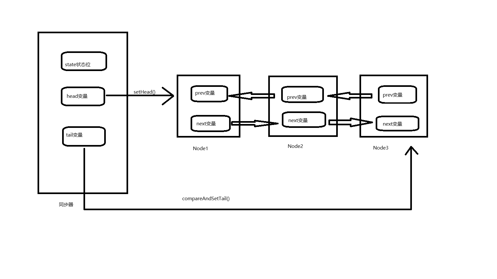

## AbstractQueuedSynchronizer前置知识
1. 公平锁和非公平锁
2. 可重入锁
3. 自旋思想
4. LockSupport
5. 数据结构之双向链表
6. 设计模式之模板设计模式
## AQS入门级别理论知识
1. 是什么？
    * 字面意思：抽象的队列同步器
    * 技术解释：
        1. 是用来实现锁或者其他同步器组件的公共基础部分的抽象实现，是<font color='green'>重量级基础框架及整个JUC体系的基石，主要用于解决锁分配给“谁”的问题</font>。
        2. 整体就是一个抽象的FIFO（先进先出）队列来完成资源获取线程的排队工作，并通过一个原子int类变量表示持有锁的状态。
2. 为什么AQS是JUC的基石？
    * 与AQS有关的常见类：ReentrantLock、CountDownLatch、ReentrantReadWriteLock、Semaphore、CyclicBarrier...
    * 进一步理解锁和同步器的关系
        1. 锁，面向锁的使用者：定义了程序员和锁交互的使用层API，隐藏了实现细节，调用即可
        2. 同步器，面向锁的实现者：Java并发大神DougLee，提出同一规范并简化了锁的实现，将其抽象出来屏蔽了同步状态管理、同步队列的管理和维护、阻塞线程排队和通知、唤醒机制等，是一切锁和同步组件实现的----公共基础部分。
3. 能干嘛？
    * 加锁会导致阻塞：有阻塞就需要排队，实现排队必然需要队列
    * 解释说明：
        1. 抢到资源的线程直接使用，抢不到资源的必然涉及一种<font color='green'>排队等候机制</font>。
        2. 如果共享资源被占用，就需要一定的阻塞等待唤醒机制来保证锁分配。这个机制主要用的是CLH队列的变体实现的，将暂时获取不到锁的线程加入到队列中，这个队列就是AQS同步队列的抽象表现。它将要请求共享资源的线程及自身的等待状态封装成队列的结点对象Node，通过CAS、自旋以及LockSupport.park()的方式，维护state变量的状态，使并发达到同步的效果。
    * 小总结：AQS同步队列的基本结构如图
## AQS源码分析前置知识
1. AQS内部体系结构
    * AQS自身：
        1. AQS的 private volatile int state 变量：类似于银行办理业务的受理窗口状态；0就是没有人，自由状态可以办理；大于等于1，有人占用窗口，等着去。
        2. AQS的CLH队列变体（CLH是单向链表，AQS使用了变体双向链表）
    * 内部类Node：
        1. Node的 volatile int waitStatus 变量：节点的等待状态，Node类中定义了常量用来表示。
        2. 内部结构：
            ```java
                static final class Node {
                    //共享模式（表示线程以共享的模式等待锁）
                    static final Node SHARED = new Node();
                    //强占模式（表示线程正在以独占的方式等待锁）
                    static final Node EXCLUSIVE = null;
                    //请求被取消，当前节点无效
                    static final int CANCELLED =  1;
                    //后继线程需要唤醒（表示线程已经准备好了，就等资源释放了）
                    static final int SIGNAL    = -1;
                    //等待condition唤醒（表示节点在等待对列中，节点线程等待唤醒）
                    static final int CONDITION = -2;
                    //共享式同步状态获取将会无条件地传播下去（当前线程处于SHARED情况下，该字段才会使用）
                    static final int PROPAGATE = -3;
                    //初始为0，状态是上面的几种
                    volatile int waitStatus;
                    //前置节点
                    volatile Node prev;
                    //后续节点
                    volatile Node next;
                    //封装的线程
                    volatile Thread thread;
                //指向下一个处于CONDITION状态的节点
                    Node nextWaiter;

                    final boolean isShared() {
                        return nextWaiter == SHARED;
                    }
                    //返回前驱节点，没有的话抛出nullpoint异常
                    final Node predecessor() throws NullPointerException {
                        Node p = prev;
                        if (p == null)
                            throw new NullPointerException();
                        else
                            return p;
                    }

                    Node() {    // Used to establish initial head or SHARED marker
                    }

                    Node(Thread thread, Node mode) {     // Used by addWaiter
                        this.nextWaiter = mode;
                        this.thread = thread;
                    }

                    Node(Thread thread, int waitStatus) { // Used by Condition
                        this.waitStatus = waitStatus;
                        this.thread = thread;
                    }
                }
            ```
## AQS源码深度讲解和分析（以ReentrantLock为例）
1. ReentrantLock详解
    * 构造方法：
        ```java
        public ReentrantLock() {
        sync = new NonfairSync();
        }

        public ReentrantLock(boolean fair) {
            sync = fair ? new FairSync() : new NonfairSync();
        }
        // FairSync 和 NonfairSync 继承自Sync类
        ```
    * lock方法：
        ```java
        public void lock() {
            sync.lock();
        }
        ```
        ```java
        static final class NonfairSync extends Sync {
            private static final long serialVersionUID = 7316153563782823691L;

            /**
             * Performs lock.  Try immediate barge, backing up to normal
             * acquire on failure.
             */
            final void lock() {
                if (compareAndSetState(0, 1))
                    setExclusiveOwnerThread(Thread.currentThread());
                else
                    acquire(1);
            }
        }
        ```
        ```java
        static final class FairSync extends Sync {

            final void lock() {
                acquire(1);
            }
        }
        ```
        ```java
        public final void acquire(int arg) {
            if (!tryAcquire(arg) &&
                acquireQueued(addWaiter(Node.EXCLUSIVE), arg))
                selfInterrupt();
        }
        ```
        可以看到lock()方法最终都需要调用到AQS内部的方法。
        ```java
        //此方法是AQS类定义的一个模板方法。FairSync类重写了此方法
        protected final boolean tryAcquire(int acquires) {
            final Thread current = Thread.currentThread();
            int c = getState();
            if (c == 0) {
                if (!hasQueuedPredecessors() &&
                    compareAndSetState(0, acquires)) {
                    setExclusiveOwnerThread(current);
                    return true;
                }
            }
            else if (current == getExclusiveOwnerThread()) {
                int nextc = c + acquires;
                if (nextc < 0)
                    throw new Error("Maximum lock count exceeded");
                setState(nextc);
                return true;
            }
            return false;
        }
        ```
        ```java
        //此方法是AQS类定义的一个模板方法。NotfairSync类重写了此方法
        protected final boolean tryAcquire(int acquires) {
            return nonfairTryAcquire(acquires);
        }

        //此方法位于ReentrantLock类内部
        final boolean nonfairTryAcquire(int acquires) {
            final Thread current = Thread.currentThread();
            int c = getState();
            if (c == 0) {
                if (compareAndSetState(0, acquires)) {
                    setExclusiveOwnerThread(current);
                    return true;
                }
            }
            else if (current == getExclusiveOwnerThread()) {
                int nextc = c + acquires;
                if (nextc < 0) // overflow
                    throw new Error("Maximum lock count exceeded");
                setState(nextc);
                return true;
            }
            return false;
        }
        ```
        从上面的代码中可以看到，FairSync和NotfairSync的不同之处至于<font    color='green'>!hasQueuedPredecessors()</font>，这个方法的作用就是查看前面是否有节点：
        ```java
        public final boolean hasQueuedPredecessors() {
            // The correctness of this depends on head being initialized
            // before tail and on head.next being accurate if the current
            // thread is first in queue.
            Node t = tail; // Read fields in reverse initialization order
            Node h = head;
            Node s;
            return h != t &&
                ((s = h.next) == null || s.thread != Thread.currentThread());
        }
        ```
        * 公平锁：公平锁讲究先来后到，线程在获取锁时，如果这个锁的等待队列中已经有线程在等待，那么当前线程会进入等待队列中。
        * 非公平锁：不管是否有等待对俩，如果可以获取锁，则立刻占用锁对象。也就是说队列的第一个排队线程苏醒后，不一定就是排头的这个线程获得锁，它还是需要参加竞争锁（存在线程竞争的情况下），后来的线程可能不讲武德插队抢锁了。

