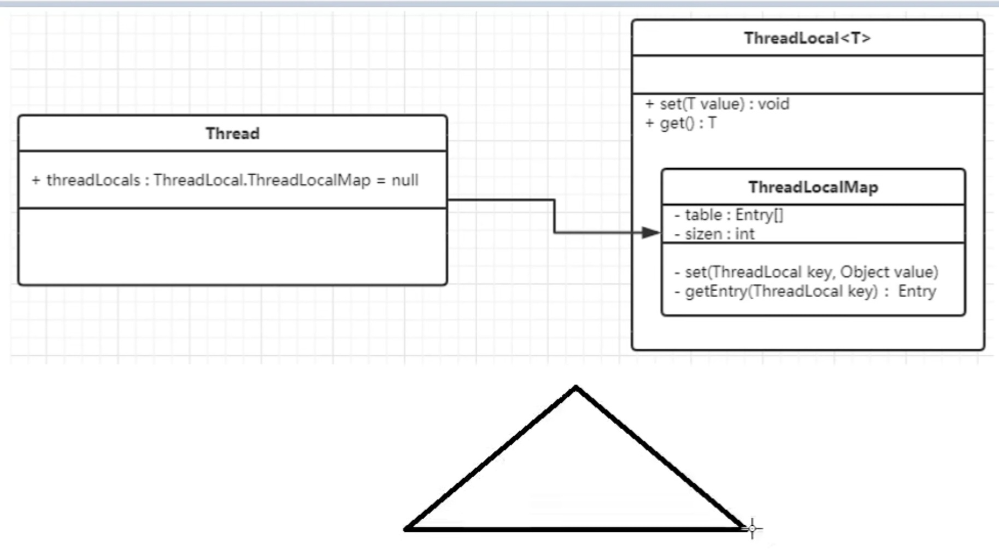

## 大厂面试题
* ThreadLocal中ThreadLocalMap的数据结构和关系？
* ThreadLoacl的key是弱引用，这是为什么？
* ThreadLocal内存泄漏问题你知道吗？
* ThreadLocal中最后为什么要加上remove方法？
## 简介
ThreadLocal提供线程局部变量。这些变量和正常的变量不同，因为每一个线程在访问ThreadLocal实例的时候 *<font color='green'>都有自己的、独立初始化的变量副本</font>* 。ThreadLocal实例通常是类中的私有静态字段，使用它的目的是希望将状态（例如，用户ID和事务ID）与线程关联起来。
## 能干吗
实现 *<font color='green'>没一个线程都有自己专属的本地变量副本</font>*，主要解决了让每个线程绑定自己的值，通过使用get()和set()方法，获取默认值或将其值更改为当前线程所存副本的值从而避免了线程安全问题，比如我们之前讲解的8锁案例，资源类是使用的同一部手机，多个线程抢夺同一部手机使用，假如人手一份是不是天下太平？？
## 源码分析
1. Thread类中有使用ThreadLocalMap这个类
```java
/* ThreadLocal values pertaining to this thread. This map is maintained
* by the ThreadLocal class. */
ThreadLocal.ThreadLocalMap threadLocals = null;
/*
* InheritableThreadLocal values pertaining to this thread. This map is
* maintained by the InheritableThreadLocal class.
*/
ThreadLocal.ThreadLocalMap inheritableThreadLocals = null;
```
2. ThreadLocalMap是ThreadLocal的一个静态内部类
```java
/**
 * ThreadLocalMap is a customized hash map suitable only for
 * maintaining thread local values. No operations are exported
 * outside of the ThreadLocal class. The class is package private to
 * allow declaration of fields in class Thread.  To help deal with
 * very large and long-lived usages, the hash table entries use
 * WeakReferences for keys. However, since reference queues are not
 * used, stale entries are guaranteed to be removed only when
 * the table starts running out of space.
 */
static class ThreadLocalMap {
    
}
```
3. ThreadLocalMap中又有一个静态内部类Entry
```java
/**
 * The entries in this hash map extend WeakReference, using
 * its main ref field as the key (which is always a
 * ThreadLocal object).  Note that null keys (i.e. entry.get()
 * == null) mean that the key is no longer referenced, so the
 * entry can be expunged from table.  Such entries are referred to
 * as "stale entries" in the code that follows.
 */
static class Entry extends WeakReference<ThreadLocal<?>> {
    /** The value associated with this ThreadLocal. */
    Object value;

    Entry(ThreadLocal<?> k, Object v) {
        super(k);
        value = v;
    }
}
```
4. Thread类中的threadLocalMap变量实质上是一个一threadLocal实例为key，任意对象为value的Entry对象；当我们为threadLocal变量赋值时，实际上就是以当前threadLocal实例为key，值为value的Entry往这个threadLocalMap中存放。
```java
/**
 * Create the map associated with a ThreadLocal. Overridden in
 * InheritableThreadLocal.
 *
 * @param t the current thread
 * @param firstValue value for the initial entry of the map
 */
void createMap(Thread t, T firstValue) {
    t.threadLocals = new ThreadLocalMap(this, firstValue);
}
```
5. Thread、ThreadLocal、ThreadLocalMap、Entry四者关系如图

## ThreadLocal的内存泄漏问题
1. 什么是内存泄漏？
不再会被使用的对象或者变量占用的内存不能被回收，就是内存泄漏
2. 为什么ThreadLoacl可能会引起内存泄漏？
    * ThreadLocaMap从字面上就可以看出是一个保存ThreadLocal对象的map（以ThreadLocal为key），不过是经过了两层包装的ThreadLocal对象：
    ```java
    static class ThreadLocalMap { //简化版本
        static class Entry extends WeakReference<ThreadLocal<?>> {
            
            Object value;

            Entry(ThreadLocal<?> k, Object v) {
                super(k);
                value = v;
            }
        }
    }
    ```
        1. 第一层包装是使用WeakReference<ThreadLocal<?>>将ThreadLocal对象变成一个<font color='red'>弱引用对象</font>
        2. 第二层包装是定义了一个专门的类Entry类扩展WeakReference<ThreadLocal<?>>
    * 强引用、弱引用、软引用、虚引用相关知识 [点此跳转](./reference.md)